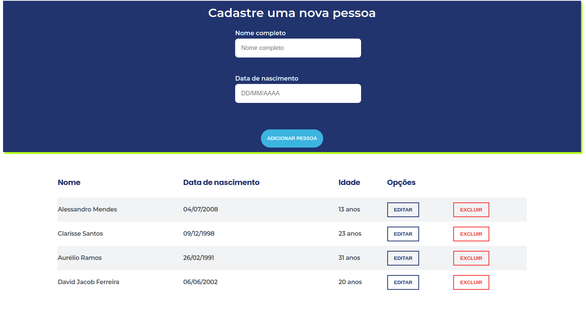
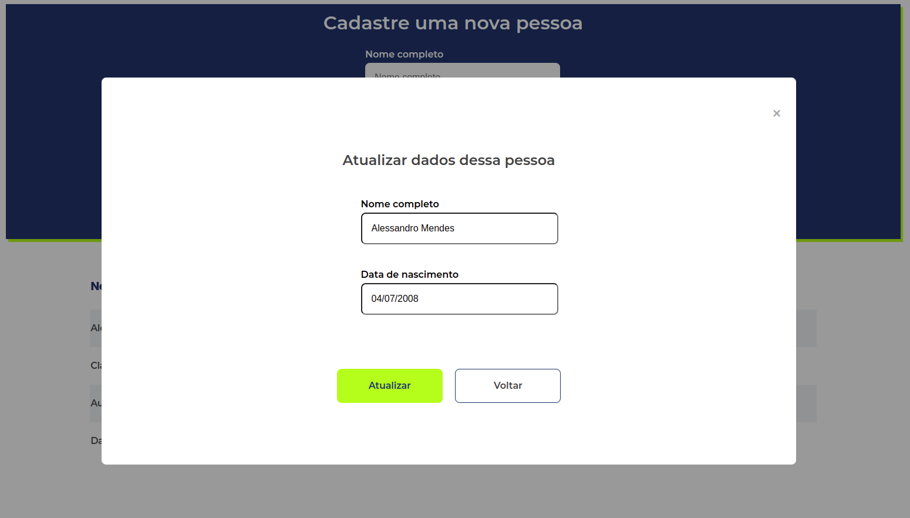
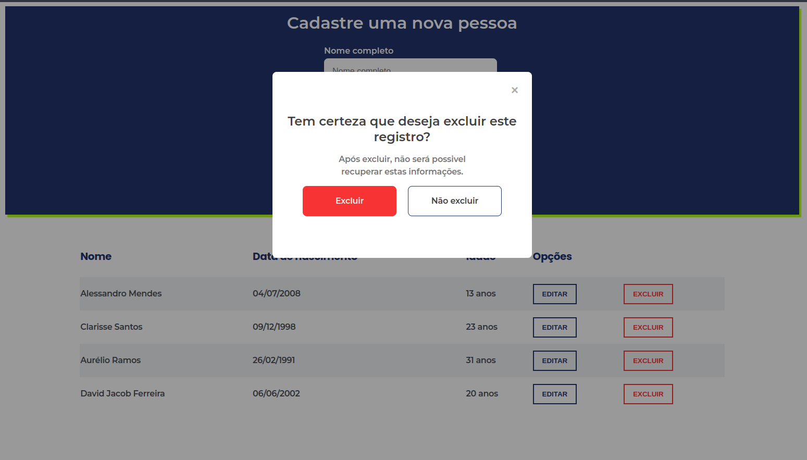

# simple-registration

Este projeto é uma aplicação que permite inserção de valores de nome e data de nascimento. E retorna nome e idade de acordo com a data atual. Também é possível editar e excluir os valores já cadastrados

## Tecnologias utilizadas

* React
* Axios
* NodeJS
* Express
* Sequelize
* MySQL

## Antes de rodar o projeto projeto

* Clone o repositório com o seguinte comando no seu terminal:
  * `git clone git@github.com:Anderson-Alencar/simple-registration.git`

* Instale as dependências do projeto:
  * Front-end   
    * `cd simple-registration`
    * `cd app`
    * `cd frontend`
    * `npm install`
* Instale as dependências do projeto (front):
  * Back-end (aqui você pode um outro terminal a partir da pasta `simple-registration`)
    * `cd app`
    * `cd backend`
    * `npm install`

* Configurando variáveis de ambiente
  *  No diretório `app/backend/` existe um arquivo chamao `.env.example`.
  *  Renomeie esse arquivo para `.env`
  *  E subistua as informações conforme o exemplo abaixo, adicionando configurações do seu MySQL
```
  MYSQL_USER=seu-usuario-mysql
  MYSQL_PASSWORD=sua-senha-mysql
  HOSTNAME=localhost
  PORT=3001
```
⚠️ **Você deve possuir o `MySQL` previamente instalado e rodando!** ⚠️

## Como executar o projeto
* Garanta que tanto o Front quanto o Back estejam rodando.
  * No diretório `app/backend` execute o comando:
    * `npm start`
  * No diretório `app/frontend` execute o comando(lembrando, em um outro terminal):
    * `npm start`

## Comandos importantes
* No diretório `backend`:
  * utilize `npm run db:reset` para restaurar e popular o banco
  * utilize `npm test` para rodar os testes do backend

---



